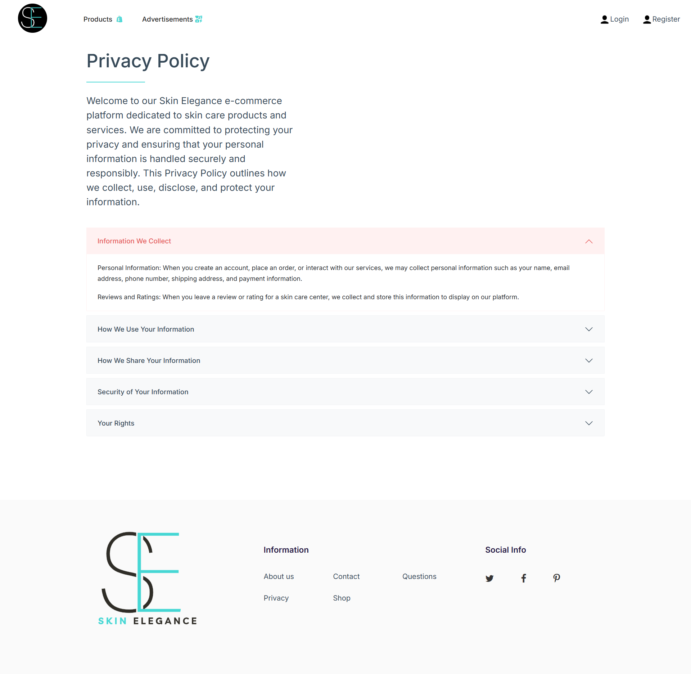
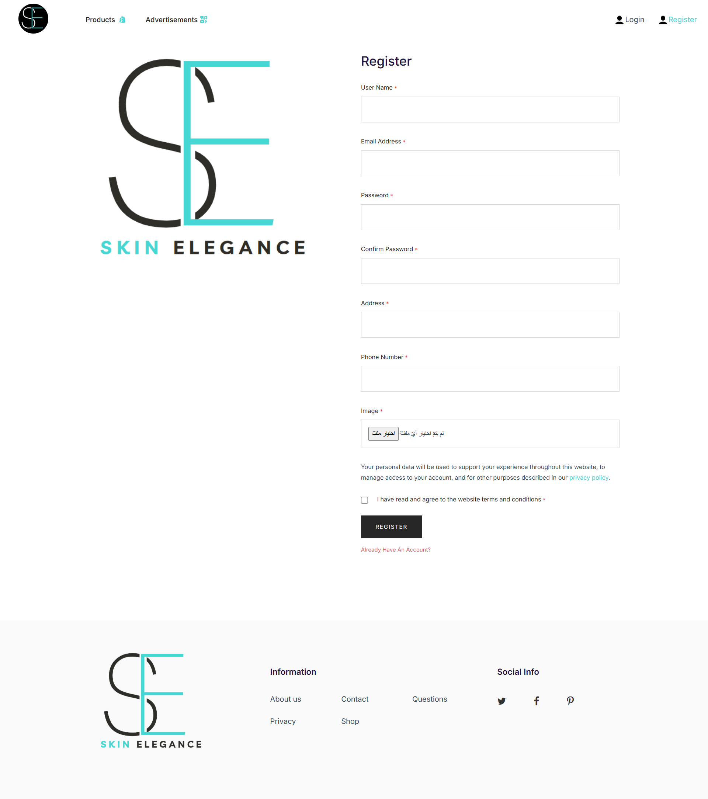
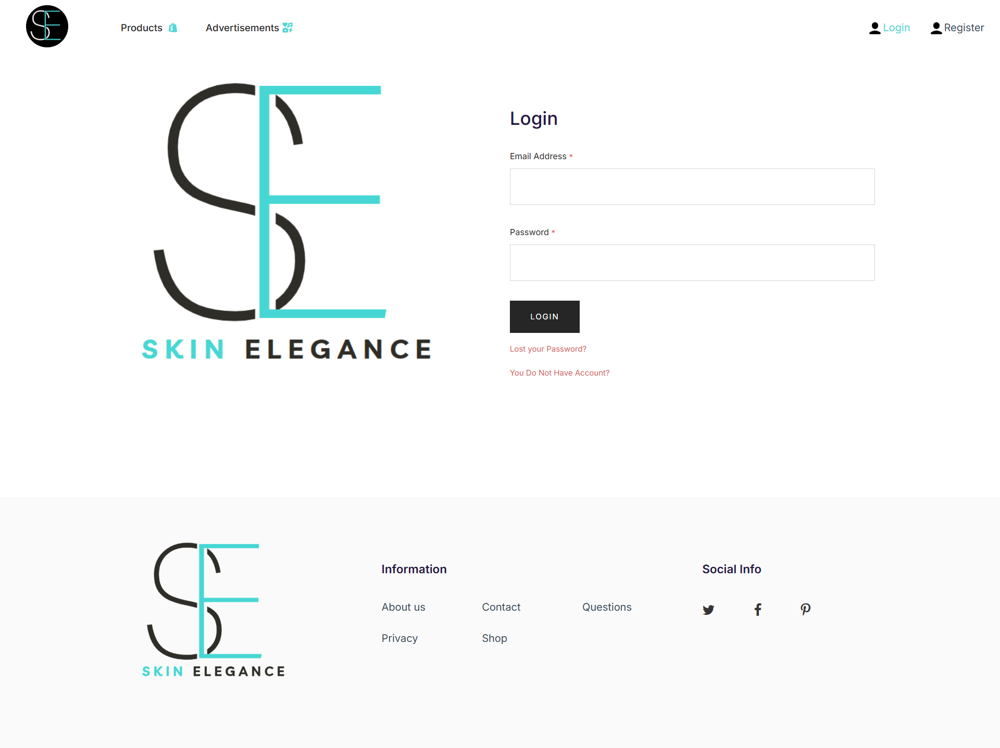

# 💄 Skin Elegance Ecommerce

[Live Demo](https://skinelegance-ecommerce.onrender.com/)

## ✨ Project Overview
**Skin Elegance Web** is a modern, responsive e-commerce website built with **React**.  
The platform is designed to provide a seamless online shopping experience for skincare enthusiasts, allowing users to browse products, view details, and make purchases effortlessly.

This project demonstrates my ability to create dynamic and interactive web applications using modern front-end technologies, focusing on both functionality and visual appeal.

---

## 🔨 Key Features
- **Responsive Design:** Fully mobile-friendly and optimized for all devices.  
- **Product Listings:** Browse and search for skincare products easily.  
- **Product Details:** View detailed descriptions, prices, and images.  
- **Shopping Cart:** Add items to cart and review before checkout.  
- **User Interaction:** Smooth animations and dynamic UI built with React components.  

---

## 👨‍💻 Technologies Used
- **React**  
- **JavaScript (ES6+)**  
- **CSS / Sass**  
- **React Router**  
- **Axios** for API calls  
- **Responsive Design / Flexbox / Grid**

---

## 📸 Screenshots
*(Replace with your actual screenshots stored in `assets` or another folder)*

### 🏠 Home Page

### 🛍️ Product Listing Page

### 📄 Product Details Page

### 📄 AboutUs Page

### 📄 Frequently Questions Page

### 📄 Privacy Page

### 📄 Register Page

### 📄 Login Page

 
 
